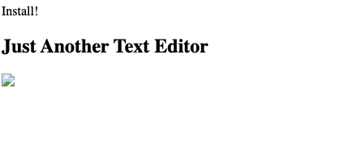
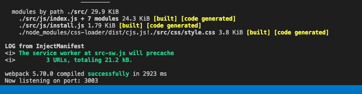

# text-editor

  ##  
  ## 

  [Click here to see the deployed app.](https://text-editor-march-2022.herokuapp.com/)

  ## Licensing:
  
  ## Table of Contents: 
  - [Description](#description)
  - [Technology](#technology)
  - [Installation](#installation)
  - [Questions](#questions)

  ## Description:
  This is a first attempt at a single page text editor app that meets some of the creiteria of a progressive web app.   
  ## Technology:
  Webpack, Babel, JS
  ## Installation: 
  In the terminal at the root level, run npm install and npm start.  This will start the npm run build command from the package.json configuration. This runs on port 3003 since other projects in the class tend to be set to run on 3001.  
  ## License: 
  None Provided 
  ## Questions: 
  lmc@uga.edu
  
  <https://github.com/tripledawg>